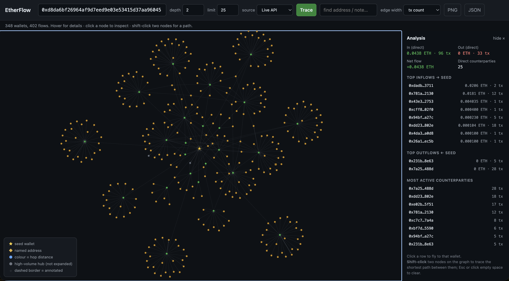

# EtherFlow



Local Flask app for **tracing and visualizing Ethereum wallet-to-wallet flow**.
Enter a seed address, crawl its transaction graph a few hops out, and explore it as an
interactive force-directed graph. Built for ad-hoc investigations: no database, no build
step, one Python file plus one HTML template.

```text
Browser (vis-network)  ──fetch──►  Flask /api/trace ──► BFS crawl (NetworkX DiGraph)
                                                            │
                                          ┌─────────────────┴───────────┐
                                          ▼                             ▼
                            Etherscan API V2 account/txlist    data/*.csv exports
                            (free tier, rate-limited)          (no API key needed)
```

## Quick start

### Docker

```bash
docker compose up --build
# open http://localhost:5000
```

An Etherscan API key (free, email signup at <https://etherscan.io/myapikey>) enables the
live-API source; put it in `.env` as `ETHERSCAN_API_KEY=...` — compose picks it up
automatically. Without a key, use the CSV source: drop Etherscan CSV exports into `data/`
(mounted into the container; annotations persist there too).

### Local

```bash
python3 -m venv .venv && source .venv/bin/activate
pip install -r requirements.txt
cp .env.example .env        # add your Etherscan API key (optional if using CSVs)
python app.py               # http://localhost:5000
```

Requires Python 3.10+.

## Data sources

- **Live API** — Etherscan API V2 (`chainid=1`), normal transactions, newest 200 per
  address, throttled under the free-tier 3 calls/sec. A brand-new key can take a few
  minutes to activate (surfaces as a 502 "Invalid API Key" until then).
- **CSV** — drop Etherscan **Export Transactions** and/or **Export Internal Transactions**
  files into `data/`; both formats are auto-detected and can be mixed. Exports for several
  wallets let the crawl expand multiple hops. Nametags in internal exports (e.g. "Uniswap
  V2: Router 2") become node labels. Seed addresses are auto-detected from export filenames.

## Usage

| Control | Meaning | Default / Max |
| ------- | ------- | ------------- |
| address | Seed wallet to start from | vitalik.eth demo |
| depth | Hops to crawl | 2 / 4 |
| limit | Counterparties kept per wallet (top-N by tx count) | 25 / 100 |
| source | Live API or CSV | Live API |
| find | Search nodes by address, nametag, or note (Enter) | — |
| edge width | Thickness = tx count or ETH volume | tx count |
| PNG / JSON | Download graph snapshot / raw graph data | — |

Reading the graph: **★** seed · **◆** named address · dot colour = hop distance ·
grey = high-volume hub (shown but not expanded through) · dashed border = annotated ·
arrows = transfer direction (bidirectional pairs render as two arcs). A legend sits
bottom-left.

Interactions:

- **Click a node** → inspector dialog: flow stats (in/out/net ETH, counterparties, active
  date range), **Expand +1 hop** (grow the graph from that wallet without re-tracing),
  persistent note + colour (saved to `annotations.json`), paginated transaction list with
  Etherscan links.
- **Shift-click two nodes** → shortest path highlighted (directed preferred, undirected
  fallback); Esc clears.
- **Analysis sidebar** (after each trace) → seed in/out/net flow, top counterparties by
  volume and by activity; click a row to fly to that wallet.

## Configuration

| Env var | Default | Notes |
| ------- | ------- | ----- |
| `ETHERSCAN_API_KEY` | — | Required for the live-API source only |
| `ETHERSCAN_BASE_URL` | `https://api.etherscan.io/v2/api` | V1 is deprecated |
| `ETHERSCAN_CHAIN_ID` | `1` | Ethereum mainnet |
| `ETHERFLOW_DATA_DIR` | `data` | CSV export directory |
| `ETHERFLOW_ANNOTATIONS` | `annotations.json` | `data/annotations.json` in Docker |
| `FLASK_RUN_HOST` / `FLASK_RUN_PORT` | `127.0.0.1` / `5000` | Docker binds `0.0.0.0` |
| `FLASK_DEBUG` | off | `1` enables auto-reload |

## Guardrails

Active wallets have thousands of counterparties, so the crawl is bounded: `limit` keeps
only the most frequent counterparties per node, `depth` is capped at 4 server-side, known
high-volume hubs (routers, burn address — `KNOWN_HIGH_VOLUME` in `app.py`) are never
expanded through, and API calls are throttled. Free-tier note: from 2026-07-01 Etherscan
caps free requests at 1,000 records; EtherFlow fetches ≤200 per address and is unaffected.

## Project layout

```text
app.py               # Flask app: Etherscan client, CSV loader, BFS crawl, JSON API
templates/index.html # single-page UI (vis-network via CDN)
data/                # CSV exports + annotations (git-ignored, Docker volume)
Dockerfile, docker-compose.yml
```

## Roadmap

- [ ] Internal transactions via API (`txlistinternal`) and ERC-20 transfers (`tokentx`)
- [ ] Caching of fetched tx lists to cut repeat API calls
- [ ] Time-window filtering on the crawl
- [ ] In-browser CSV upload
